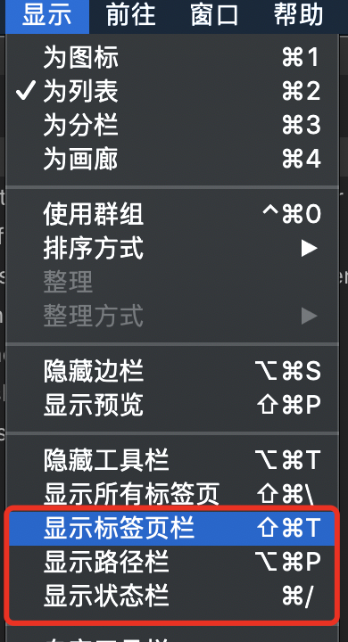

# 系统设置

在任何的操作系统中，首先你需要做一件事就是**更新系统**，点击窗口左上角的 *Apple menu () > About This Mac > Software Update* 。此外，如果这是一部新的电脑，你还需要到系统设置进行一些适当调整。如何调整，取决于个人喜好。

## Trackpad（触控板）

- System Preferences（系统偏好设置） > Trackpad（触控板）
  - 光标与点按
    - ✓ 默认全选
  - 滚动缩放
    - ✓ 默认全选
  - 更多手势
    - ✓ 默认全选

  最好跟着按键提示文本做几遍,熟悉触控板.

## 设置输入法

- 安装第三方输入法
  - [搜狗拼音输入法](https://pinyin.sogou.com/mac/)
  - [搜狗拼音输入法](https://pinyin.sogou.com/mac/wubi.php)

## Dock (程序坞)

- ✓ 置于屏幕上的位置：左边 (这样可以给屏幕上下留出更多空间)
- ✓ 设置 Dock 图标更小（大小随个人喜好）
- ✓ 自动显示和隐藏 Dock

## Spotlight (聚焦)

- 去掉字体和书签与历史记录等不需要的内容
- 默认快捷键为`Command +Space`,如果安装了[Alfred](https://www.alfredapp.com), 则可以关闭 spotlight的快捷键, 并设置为Alfred的快捷键.

## Finder (访达)

- Finder（访达） > View (显示)
  - ✓ 显示标签页栏
  - ✓ 显示路径栏
  - ✓ 显示状态栏

  

- Finder （访达）> Preferences (偏好设置)
  - General（通用）
    - 开启新 Finder 窗口时打开：HOME「用户名」目录
  - Sidebar（边栏）
    - 添加 HOME「用户名」目录

## 顶部菜单栏

- 点击"电池图标"选择"显示百分比".

## 帐户

- 添加 iCloud 用户，设置日历，联系人,邮件和查找我的Mac 等等选项.
