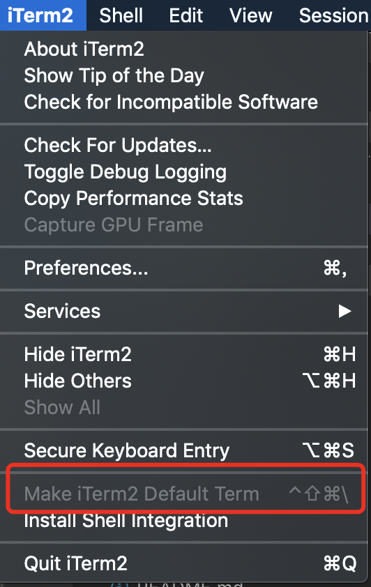

# iTerm2

## 安装

直接在官网 https://iterm2.com/ 下载解压后拖拽进入 `Application` 文件夹中即可。

## 配置

- (菜单栏) *iTerm2 > Make iTerm2 Default Term*

  

### 颜色和字体设置

- 下载 [Solarized dark iterm colors](https://github.com/altercation/solarized/tree/master/iterm2-colors-solarized)，在 *Profiles -> Default -> Colors -> Load Presets* 将其导入，作为默认颜色。
- 在 Profiles -> Text 改变游标（cursor）文字和颜色，随个人喜好。
- 更多设置，可参考 [Mac终端配置，DIY你的Terminal （iTerm 2 + Oh My Zsh）](https://segmentfault.com/a/1190000012786464)